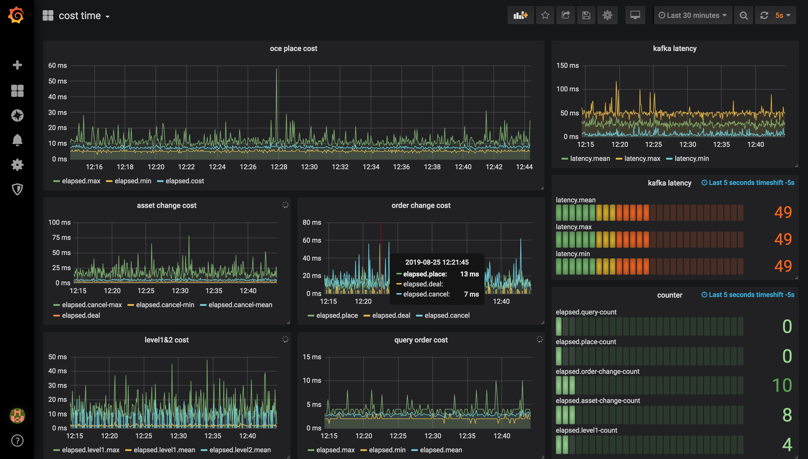

# oce-docker

## [oce-fast-up](./oce-fast-up/README.md)

Fast up a **oce** use by a single machine. The machine only 2CPU 4G RAM, 20G disk space (such as aws ec2 t2.medium or higher).

## [oce-std](./oce-std/README.md)

Start up a **oce** by standard mode. The machine at less 4CPU8G, 200G disk space(such as aws ec2 c5.xlarge or higher).

### grafana

